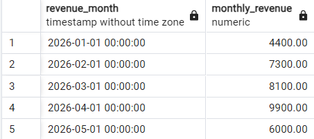
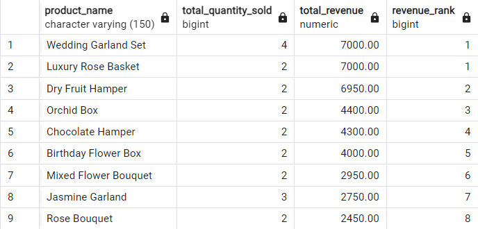
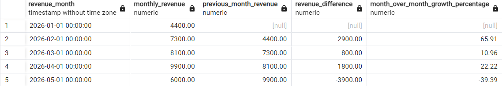
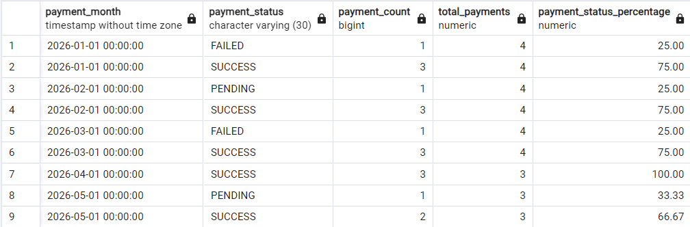
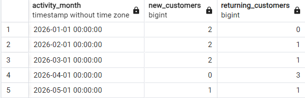

# Advanced Ecommerce SQL Analytics

## Project Overview

This project demonstrates advanced SQL analytics for a realistic ecommerce business scenario using **PostgreSQL**.

The project focuses on practical business analysis such as revenue trends, product performance, customer behavior, repeat customers, payment status analysis, and month-over-month growth.

The goal of this project is to show how SQL can be used to answer real business questions and support data-driven decision-making.

This project is designed as a portfolio project for roles such as:

- Data Analyst
- Business Analyst
- BI Analyst
- Product Analyst
- Junior Analytics Engineer
- AI/Data Analyst

---

## Business Scenario

An ecommerce company wants to understand its sales, customer, product, and payment performance.

The business wants to answer questions such as:

- How much revenue is generated monthly, weekly, and daily?
- Which products and categories perform best?
- Which customers generate the highest value?
- Are payment failures increasing or decreasing?
- How many customers are new vs returning?
- How strong is repeat customer behavior?
- What is the month-over-month revenue growth?

The SQL queries in this project answer these questions using clean, business-focused PostgreSQL analysis.

---

## Database Used

This project uses **PostgreSQL**.

The queries can be executed using:

- pgAdmin
- DBeaver
- PostgreSQL command line
- DataGrip
- Supabase SQL Editor

PostgreSQL-specific features used in this project include:

- `DATE_TRUNC`
- `EXTRACT`
- `LAG`
- `DENSE_RANK`
- `FILTER`
- Common Table Expressions
- Window functions

---

## Dataset Information

This project uses a fictional ecommerce dataset created for portfolio and learning purposes.

The dataset includes four main tables:

### 1. `customers`

Stores customer information.

Main columns:

- `id`
- `name`
- `email`
- `city`
- `created_at`

### 2. `orders`

Stores order-level transaction information.

Main columns:

- `id`
- `customer_id`
- `status`
- `grand_total`
- `created_at`

### 3. `order_items`

Stores product-level order details.

Main columns:

- `id`
- `order_id`
- `product_name`
- `category_name`
- `quantity`
- `unit_price`
- `total_amount`

### 4. `payments`

Stores payment transaction information.

Main columns:

- `id`
- `order_id`
- `status`
- `payment_method`
- `amount`
- `created_at`

---

## Skills Demonstrated

- PostgreSQL query writing
- Date-based analysis using `DATE_TRUNC`
- Aggregations using `SUM`, `COUNT`, and `AVG`
- Window functions using `LAG`, `DENSE_RANK`, and running totals
- Common Table Expressions
- Customer retention analysis
- Payment status and payment failure analysis
- Product and category performance analysis
- Month-over-month growth analysis
- Customer lifetime value ranking
- Portfolio-ready SQL documentation

---

## Project Structure

```text
advanced-ecommerce-sql-analytics/
│
├── README.md
├── sql/
│   ├── 01_create_tables.sql
│   ├── 02_insert_sample_data.sql
│   └── advanced_ecommerce_sql_analysis.sql
│
├── docs/
│   ├── business_questions.md
│   └── project_explanation.md
│
└── screenshots/
    ├── monthly_revenue.png
    ├── top_products_by_revenue.png
    ├── month_over_month_growth.png
    ├── payment_status_percentage.png
    └── new_vs_returning_customers.png
```

---

## SQL Files

### `01_create_tables.sql`

Creates the required ecommerce tables:

- `customers`
- `orders`
- `order_items`
- `payments`

### `02_insert_sample_data.sql`

Inserts fictional sample ecommerce data into the database.

### `advanced_ecommerce_sql_analysis.sql`

Contains advanced SQL queries for business analysis, including revenue trends, product ranking, customer retention, payment status, and month-over-month growth.

---

## How to Run This Project

### Step 1: Create a PostgreSQL Database

Create a new database named:

```sql
ecommerce_sql_analytics
```

You can create it using pgAdmin or PostgreSQL command line.

---

### Step 2: Create the Tables

Run the table creation script:

```sql
sql/01_create_tables.sql
```

This creates the following tables:

- `customers`
- `orders`
- `order_items`
- `payments`

---

### Step 3: Insert Sample Data

Run the sample data script:

```sql
sql/02_insert_sample_data.sql
```

This inserts fictional ecommerce data for analysis.

---

### Step 4: Run the Analysis Queries

Run the advanced SQL analysis file:

```sql
sql/advanced_ecommerce_sql_analysis.sql
```

You can either run the full file or copy and execute individual queries based on the business question.

---

## Main Business Questions Answered

This project answers the following business questions:

1. What is the monthly revenue trend?
2. What is the weekly revenue trend?
3. How many orders are placed each day?
4. Which weekday generates the highest revenue?
5. Which hour generates the highest revenue?
6. What are the top 10 products by revenue?
7. Which product performs best in each category?
8. Who is the top customer each month?
9. What is the running total revenue?
10. What is the month-over-month revenue growth?
11. What was each customer's previous order date?
12. How many days pass between customer purchases?
13. What percentage of customers are repeat customers?
14. What is the monthly payment status percentage?
15. Are payment failures increasing or decreasing?
16. What is the average order value by month?
17. How many unique customers purchase each month?
18. How many customers are new vs returning?
19. What is each category's monthly revenue share?
20. Which customers have the highest lifetime value?

---

## Query Result Screenshots

### Monthly Revenue



### Top Products by Revenue



### Month-over-Month Revenue Growth



### Payment Status Percentage by Month



### New vs Returning Customers



---

## Key SQL Concepts Used

### Date-Based Analysis

The project uses `DATE_TRUNC` to group order and payment data by month, week, and day.

Example:

```sql
DATE_TRUNC('month', created_at)
```

This helps create business reports such as monthly revenue, weekly revenue, and payment status trends.

---

### Window Functions

The project uses window functions to compare rows, rank records, and calculate running totals.

Examples:

```sql
LAG()
DENSE_RANK()
SUM() OVER()
```

These are used for:

- Previous month comparison
- Product ranking
- Customer ranking
- Running total revenue
- Customer purchase behavior analysis

---

### Common Table Expressions

The project uses CTEs to make complex SQL queries easier to read and maintain.

Example:

```sql
WITH monthly_sales AS (
    SELECT
        DATE_TRUNC('month', created_at) AS revenue_month,
        SUM(grand_total) AS monthly_revenue
    FROM orders
    WHERE status = 'PAID'
    GROUP BY DATE_TRUNC('month', created_at)
)
SELECT *
FROM monthly_sales;
```

---

## Key Insights from Sample Analysis

- Monthly paid revenue can be tracked clearly using date-based grouping with `DATE_TRUNC`.
- Product revenue ranking helps identify top-performing products and revenue-driving categories.
- Month-over-month revenue growth analysis helps detect business growth or decline patterns.
- Payment status analysis helps monitor successful, failed, and pending payments over time.
- New vs returning customer analysis helps separate customer acquisition performance from customer retention performance.
- Customer lifetime value ranking helps identify high-value customers for loyalty and retention strategies.

---

## Business Value

This project shows how SQL can help an ecommerce business make better decisions.

The analysis can support:

- Revenue monitoring
- Product strategy
- Customer retention planning
- Payment failure tracking
- Marketing performance analysis
- Business growth reporting
- Dashboard development

---

## What I Learned

Through this project, I practiced writing business-focused SQL queries using PostgreSQL.

I strengthened my understanding of:

- Date-based revenue analysis
- Window functions
- Product ranking
- Customer retention metrics
- Payment status analysis
- Month-over-month growth calculation
- Ecommerce KPI reporting
- Writing clean and well-documented SQL scripts

This project helped me connect SQL concepts with real business questions such as revenue growth, repeat customer behavior, product performance, and payment reliability.

---

## Future Improvements

This project can be extended further by adding:

- Power BI dashboard
- Tableau dashboard
- Python-based exploratory data analysis
- Streamlit analytics app
- AI-generated business insight summary
- Larger ecommerce dataset
- Automated SQL report generation
- Customer segmentation analysis
- Cohort retention analysis

---

## Portfolio Relevance

This project is relevant for data and analytics roles because it demonstrates the ability to:

- Write advanced SQL queries
- Translate business questions into data analysis
- Use PostgreSQL for practical analytics
- Analyze ecommerce KPIs
- Present insights clearly
- Structure a project professionally for GitHub

---

## Author

**Dharani Perumal Samy**

MSc Data Analytics | SQL | PostgreSQL | Python | Power BI/Tableau | AI-assisted Analytics
